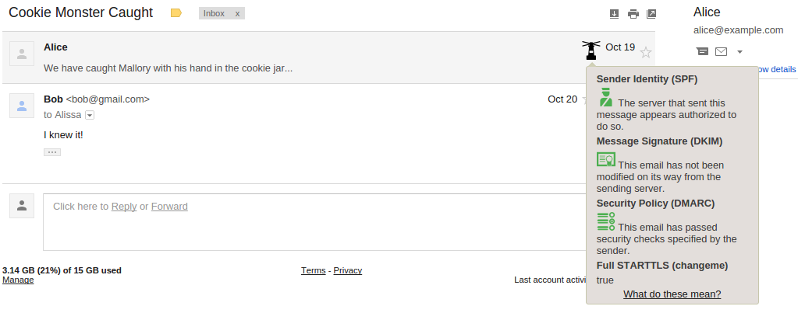

# Lantern
**Currently in heavy development**

Chrome Extension that adds a security indicator to popular webmail services. 
The use of SMTP security measures, such as STARTTLS, SPF and DKIM, are
intutatively indicated using a tooltip shown next to each email.

